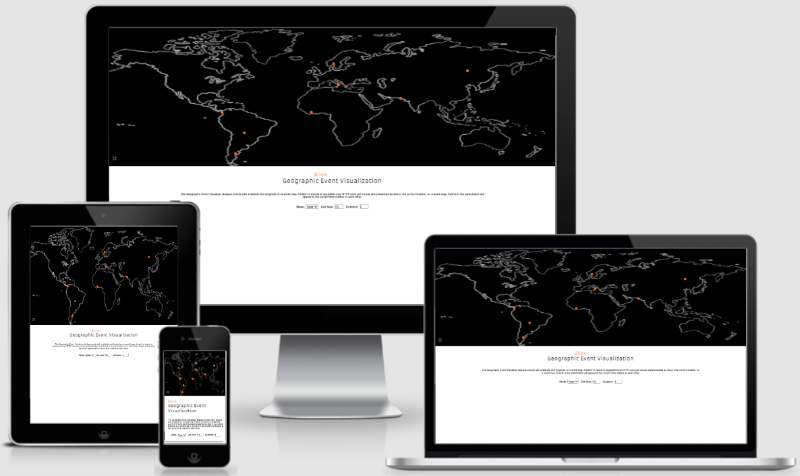
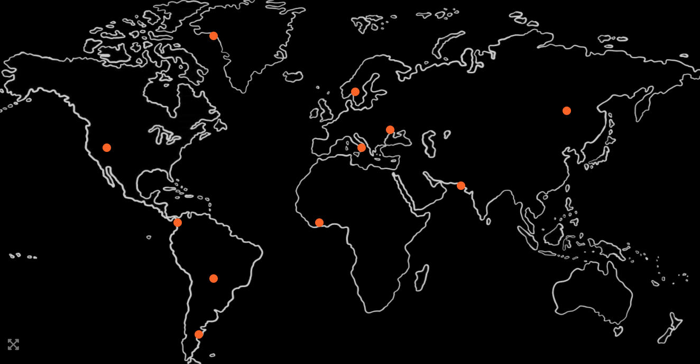
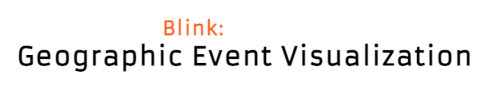
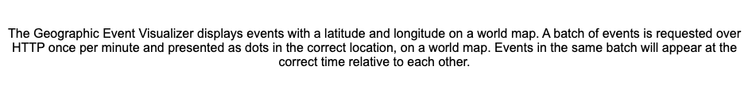
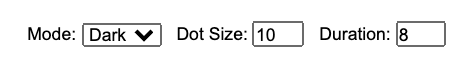
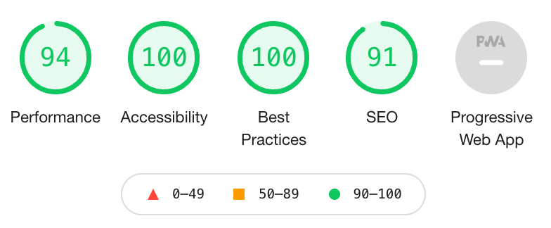

# Blink

 [Blink](https://emmabergner.github.io/blink/) is a geographic visualisation of events, and a demo aimed for the company Telcred. This company offers a cloud service for physical access control (basically unlocking doors) worldwide. Blink can be used for other companies as well who have events and use geographic locations. 

The idea behind this is to show users that events are happening, where in the world the events are happening and at what time the events are happening. 

## Features

- __The Background Display__

    - This section includes an image of a world map. The image displays where in the world the different events are happening.
    - This section allows users to click on a fullscreen icon and the image goes to fullscreen mode. 
    - This section grabs users attention with an eye-catching orange blinking dot that appears and disappears repeatedly across the image.  

    

- __The Logo and heading__

    - Center of the page: Blink is easy to spot for users, in a clear orange color. 
    - The heading: Geographic Event Visualisation is placed  just underneath the logo for a welcoming and clean impression. 
    -  This is a demo, and I've chosen my colors based of the companies own color pattern.
     

- __The Information Section__
   - This section allows users to understand what the event does and their meaning. 
 

- __User Interaction Area__
   - In this section there are three fields for users to interact:
        - Users can change color of the background, between dark and light mode.
        - Users can change the size of the dots being displayed, between size 1 and size 20. 
        - Users can change the appearance duration for the dots, between 1 and 10. 
    - The fields are set to automatic responds and shows users the immediately effect without pressing ant additional buttons. 
 

## Technologies Used 

### Languages Used

- __HTML__
- __CSS__
- __JavaScript__

### Frameworks, Libraries & Programs Used
- __Google Fonts:__
    Google Fonts were used to import the font Aramata and Roboto as the font-family into the style.css file.

- __Font Awesome:__
     Font Awesome was used for the fullscreen icon.

- __Git:__
     Git was used for version control.

- __GitPod:__
     GitPod was used to provide the programming environment. 

- __GitHub:__
    GitHub is used to store the project code.

- __Photoshop:__
 Photoshop was used to resize and to edit background image.

## Testing 

- This page is tested to work in different browsers: Chrome, Safari.
- This page is tested to work on mobile devices in different browsers: Chrome, Safari.
- This project is responsive, readable, easy to understand and looks good on all standard screen sizes.

### Bugs
- The fullscreen function does not work for Iphone. [Read more](https://developer.apple.com/documentation/webkitjs/htmlvideoelement/1630649-webkitenterfullscreen)

### Validator Testing 

 -- MÅSTE TESTA -- 
 
- HTML
  - No errors were returned when passing through the official W3C validator: 
  [index.html](https://validator.w3.org/nu/?doc=https%3A%2F%2F8000-gray-dingo-ob9ikojk.ws-eu25.gitpod.io%2Findex.html),

- CSS
  - No errors were found when passing through the official (Jigsaw) validator: [style.css](https://jigsaw.w3.org/css-validator/validator?uri=https%3A%2F%2F8000-gray-dingo-ob9ikojk.ws-eu25.gitpod.io%2Fassets%2Fcss%2Fstyle.css&profile=css3svg&usermedium=all&warning=1&vextwarning=&lang=en).

## Deployment 

- The site was deployed to GitHub pages. The steps to deploy are as follows: 
  - In the GitHub repository, navigate to the Settings tab. 
  - Select Pages in the menu.
  - From the source section drop-down menu, select the main branch.
  - Once the main branch has been selected, press Save. 

The live link can be found here -  https://emmabergner.github.io/blinkl/
  
## Credits
__Content__
- The inspiration for the project was taken from...

- The backgorund image is from: [vecteezy](https://static.vecteezy.com/ti/gratis-vektor/p1/3013055-frihand-varldskarta-skiss-pa-vit-bakgrund-vector.jpg)
- Thank you to Telcred for help with "async" and "await" function. 

