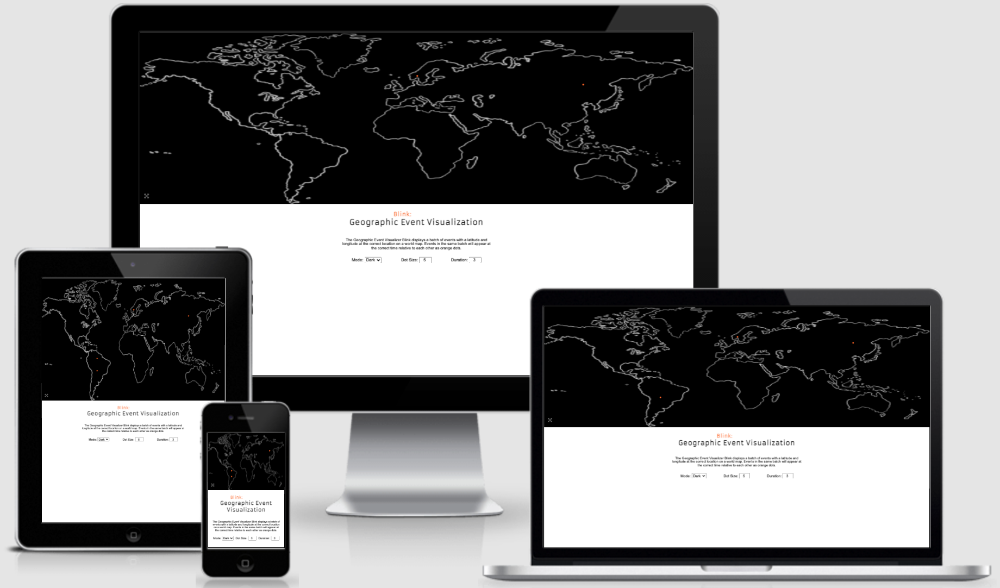
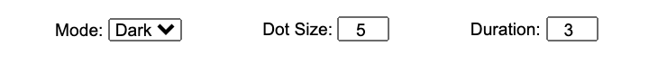
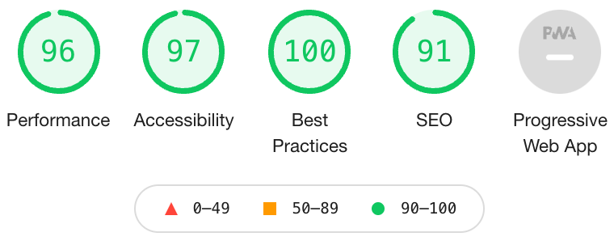

# Blink

[Blink](https://emmabergner.github.io/blink/) is a web browser application that displays a geographic visualisation of events, and a demo aimed for the company Telcred. This company offers a cloud service for physical access control (basically unlocking doors) worldwide. This version of the application comes with a built-in dataset for demonstration. The intention is to connect to a live data source but that is outside the scope of this project. 

The idea is to show users that events are happening, where in the world the events are happening and at what time the events are happening. 

 Blink can be used for other companies as well who have events and use geographic locations. It can be used externally for marketing purposes and internally for the employee ego boost. Placing a monitor running Blink in the lobby of the company achieves both. Showcasing their accomplishments and encouraging the employees to continue working hard. But also. Displaying data like this also allows users to locate where next potential expansion could be and where to possibly focus on. 

## Features

- __World Map Display__

    - This section includes an image of a world map. The map displays where in the world the different events are happening.
    - This section grabs users attention with an eye-catching orange blinking dot that appears and disappears repeatedly across the map.
     - This section also allows users to click on a fullscreen icon button and the map goes to fullscreen mode.   

  

- __The Heading__
    - Center of the page: Blink is easy to spot for users, in a clear orange color. 
    - "Geographic Event Visualisation" is placed just underneath Blink for a welcoming and clean impression. 
    -  This is a demo, and I've chosen my colors based of Telcred's graphical profile.
     

- __The Information Section__
   - This section allows users to understand what the application does and the meaning of the orange dots. 
 

- __Prefrences Area__
  - Depending on the users needs and the nature of the data, users can make adjustments to the display. There are three controls for this purpose:
    - Users can change the color of the map background, between dark and light mode.
    - Users can change the size of the dots being displayed, between size 1 and size 20. 
    - Users can change the appearance duration for the dots, between 1 and 10. A smaller value makes dots disappear quicker. 
  - The controls show users the immediate effect without the need for pressing any additional buttons. 

    

## Technologies Used 

### Languages Used
- __HTML__
- __CSS__
- __JavaScript__

### Frameworks, Libraries & Programs Used
- __Google Fonts:__
    Google Fonts were used to import the font Aramata and Roboto as the font-family into the style.css file.

- __Font Awesome:__
     Font Awesome was used for the fullscreen button icon.

- __Git:__
     Git was used for version control.

- __GitPod:__
     GitPod was used to provide the programming environment. 

- __GitHub:__
    GitHub is used to store the project code.

- __Photoshop:__
 Photoshop was used to resize and to edit background image.

## Testing 
- This page is tested to work in different browsers: Chrome and Safari.
- This page is tested to work on mobile devices in different browsers: Chrome and Safari. (See also next section.)
- This project is responsive, readable, easy to understand and looks good on all standard screen sizes.

### Known Limitations
- The fullscreen function does not work for Iphone beacuse of limitations in the platform. [Read more](https://developer.apple.com/documentation/webkitjs/htmlvideoelement/1630649-webkitenterfullscreen)

### Validator Testing 
- HTML
  - No errors were returned when passing through the official W3C validator: 
  [W3C validator](https://validator.w3.org/nu/?doc=https%3A%2F%2Femmabergner.github.io%2Fblink%2F)

- CSS
  - No errors were found when passing through the official (Jigsaw) validator: [Jigsaw validator](https://jigsaw.w3.org/css-validator/validator?uri=https%3A%2F%2Femmabergner.github.io%2Fblink%2F&profile=css3svg&usermedium=all&warning=1&vextwarning=&lang=en)

- JavaScript
  - No errors was found when passing through the official [Jshint validator](https://jshint.com/)
    - There are 11 functions in this file.
    - Function with the largest signature take 3 arguments, while the median is 1.
    - Largest function has 11 statements in it, while the median is 2.
    - The most complex function has a cyclomatic complexity value of 4 while the median is 1.

- Accessibility 
  - The colors and fronts are easy to read and accessible by running it through lighthouse in devtools. 

    

## Deployment 
- The site was deployed to GitHub pages. The steps to deploy are as follows: 
  - In the GitHub repository, navigate to the Settings tab. 
  - Select Pages in the menu.
  - From the source section drop-down menu, select the main branch.
  - Once the main branch has been selected, press Save. 

The live link can be found here -  https://emmabergner.github.io/blinkl/
  
## Credits
__Content__
- The background image is from: [vecteezy](https://static.vecteezy.com/ti/gratis-vektor/p1/3013055-frihand-varldskarta-skiss-pa-vit-bakgrund-vector.jpg)

- Thank you to engineers at Telcred for explaining JavaScript "async" and "await". 

- I also used W3Schools throughout the project. 

